# Ход решение

## Примеры к задаче

### Пример 1

```txt
3
10 20 30
1 1
```

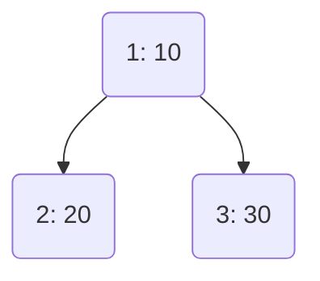

---

### Пример 2

```txt
4
5 10 15 20
1 2 2
```

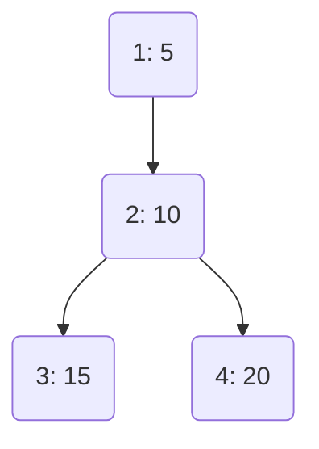

---

### Пример 3

```txt
4
1 2 3 4
1 1 3
```

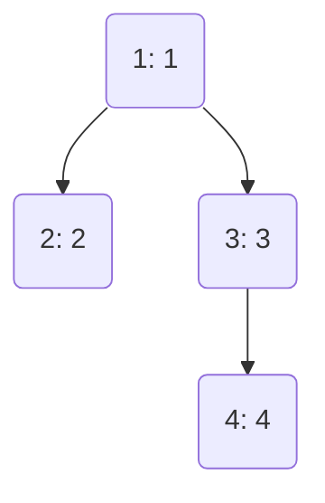

---

### Пример 4

```txt
5
1 2 3 4 5
1 2 3 4
```

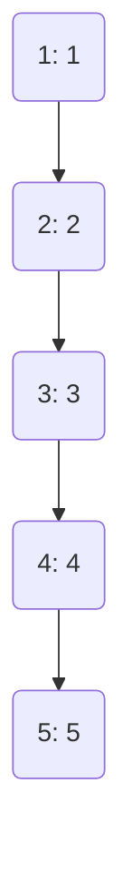

---

### Пример 5

```txt
9
1 100 1 90 80 1 2 3 4
1 1 2 4 3 3 3 3
```

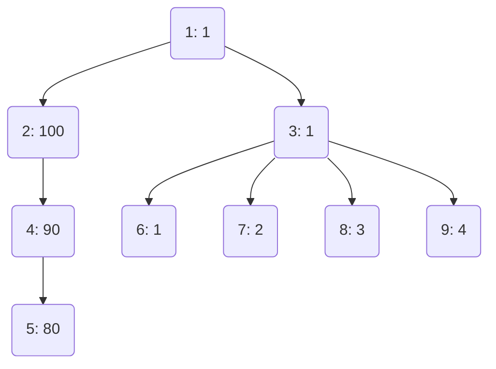

---

### Пример 6

```txt
6
5 4 10 3 9 1
1 2 1 4 1
```

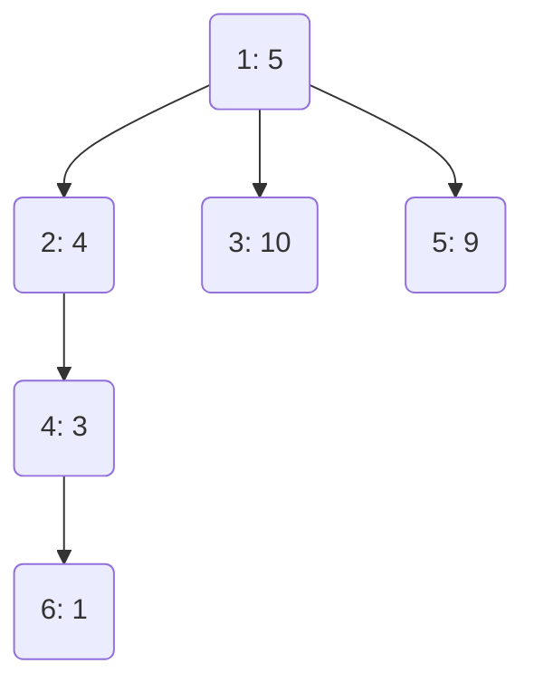

---

### Пример 7

```txt
4
10 10 20 1
1 2 1
```

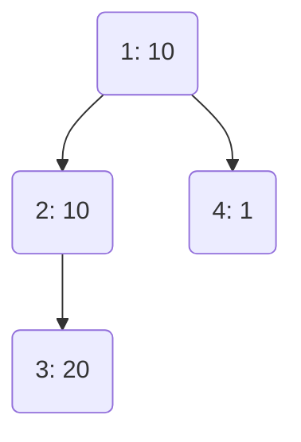

---

## Рассуждения

Возьму пример 5 как самый большой и общий.

Входные данные:

```txt
9
1 100 1 90 80 1 2 3 4
1 1 2 4 3 3 3 3
```

Результат:

```txt
-1 -1 -1 -1 110 200 280 281 282
```

Предельные случаи:
1. это когда все вершины поодиночке (все множества по одной вершине, получается n множеств).
2. это когда все вершины в одном множестве (это будет всё дерево).

Первый случай не имеет ограничений и может быть реализован всегда.

Второй случай ограничен условием - всё что две вершины и более - это путь от листа к корню дерева.
Получается, что минимально возможное количество множеств ограничено количеством листьев - всё что меньше - выдать "-1".

Всё остальное - промежуточные варианты.

Для каждого числа n (число групп или путей, на которое разбиваем дерево) нужно вывести оценку - одно число.
Это число - сумма максимально возможной подборки значений среди вершин группы.

На каждом цикле нам дано число - на какое количество групп нужно разбить дерево.
Группы надо подобрать так, чтобы оценка разбиения с указанным числом групп получилась максимальной.
Как этого достичь?

Каждая вершина - имеет свою ценность (для примера `5` это `1 100 1 90 80 1 2 3 4`).

Для каждой группы мы производим оценку, она заключается в поиске вершины в группе с максимальной ценностью.

После этого мы складываем оценки всех групп и так получаем оценку всего разбиения.

Чтобы получить максимальную оценку разбиения имеет смысл отсортировать вершины по их ценности.

Чтобы оценить минимальное число групп, на которое можно разбить дерево - нужно найти число его листьев.

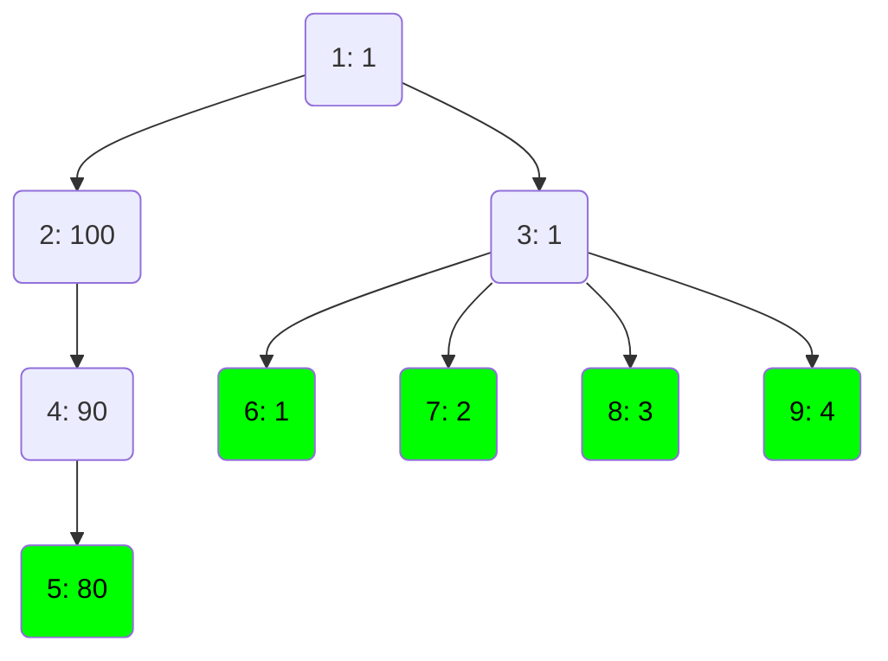

У данного графа их 5, значит всё, что меньше 5 групп надо выдать -1.

---

Первый вариант, который можем получить - это 5 групп.

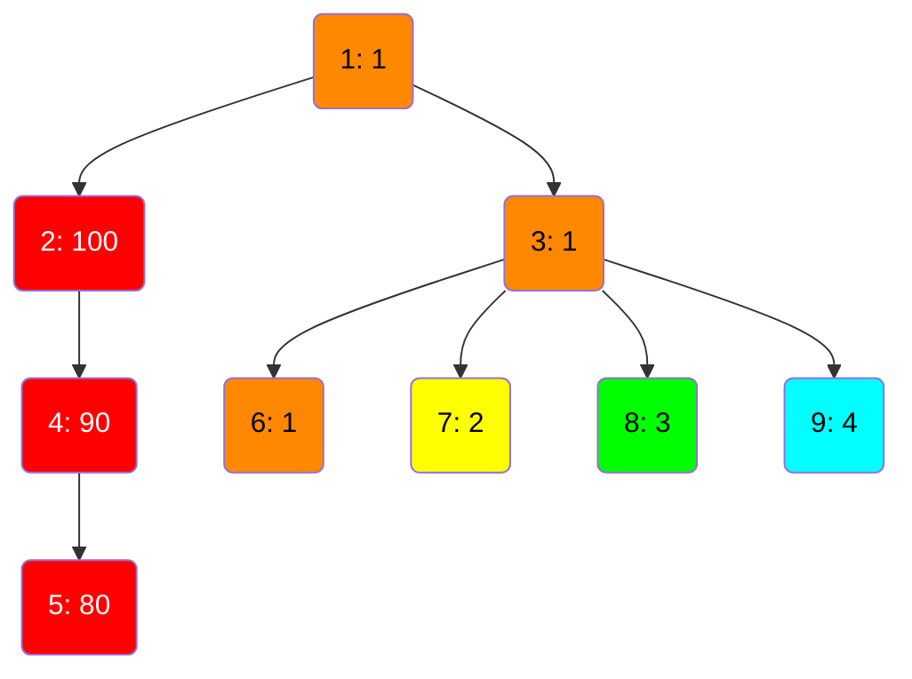

Оценка групп:
- К:    100
- О:    1
- Ж:    2
- З:    3
- Г:    4

Суммарно    `110`

Наблюдение: в данном случае - неважно куда попадёт корень, так как его значение минимальное.

---

Далее - 6 групп.

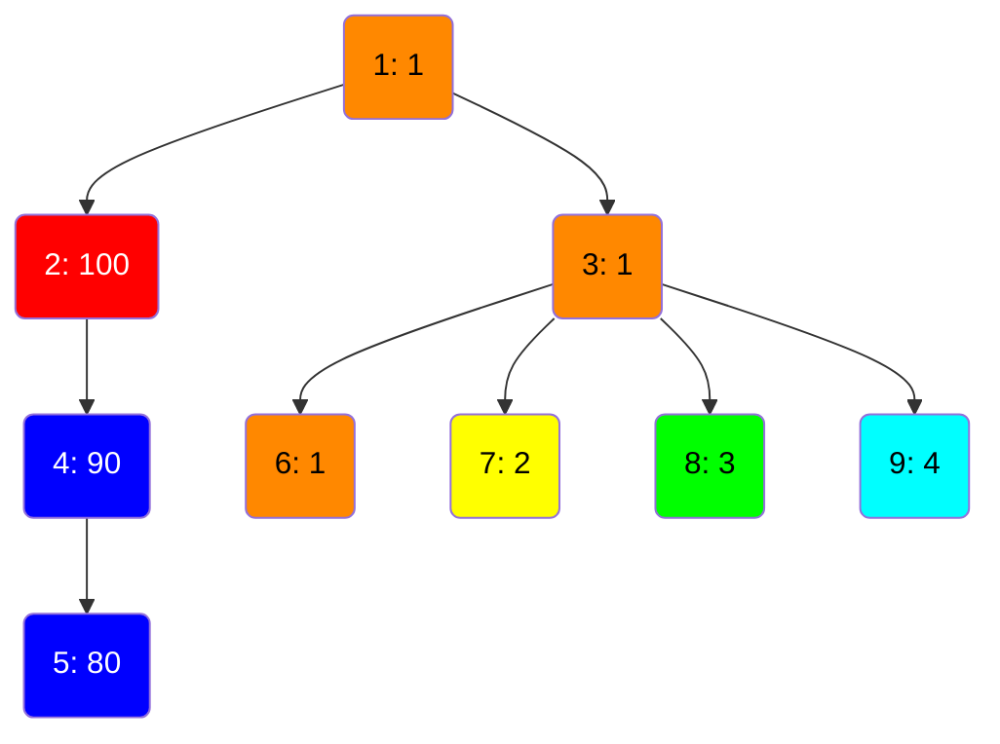

Оценка групп:
- К:    100
- О:    1
- Ж:    2
- З:    3
- Г:    4
- C:    90

Суммарно:   `200`

Наблюдение: в данном случае мы взяли предыдущее разбиение, нашли вершину с самой большой ценностью после 100 - это 90 и сделали из красной группы 2 шт. - красную и синюю. Благодаря новой группе можно к предыдущему результату добавить ещё 90, получится 110 + 90 = 200.

Наблюдение 2: во всех тестовых примерах оценка разбиения всегда возрастает.

---

Далее - 7 групп.

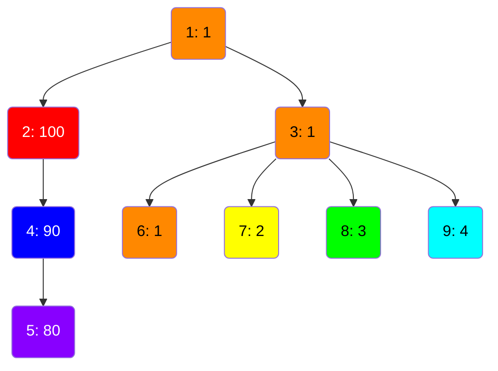

Оценка групп:
- К:    100
- О:    1
- Ж:    2
- З:    3
- Г:    4
- C:    90
- Ф:    80

Суммарно:   `280`

---

Далее - 8, 9

Дальше берём оранжевую группу и разбиваем подграф на 8 и 9 групп, получаю сумму 281 и 282.

Тут всё очевидно.

---

Нужно сделать пример, который бы охватывал следующие моменты:
1. Ценность узлов должна или расти или убывать от корня к листу (чтобы в примере были оба варианта).
2. Ценность корня дерева не должна быть максимальной или минимальной.

Сделаю пример с тремя путями от самого корня.

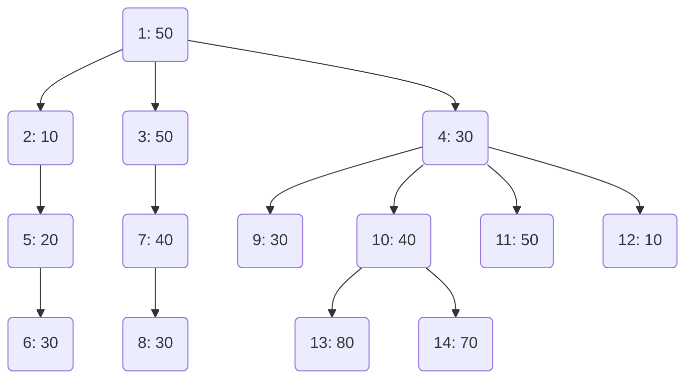

7 листьев - значит минимум 7 групп мы можем получить на первом шаге.

Можно выделить первый шаг решения:
Обход дерева в грубину для подсчёта числа листьев и распределения узлов по группам для самого первого варианта.

Почему лучше НЕ начинать с варианта - когда все узлы отдельно (когда размер группы - 1 узел, а число групп равно числу узлов)?

Лучше начну с минимального числа групп.

При минимальном k каждая цепь обязана заканчиваться в листе. Это означает:
- Каждый лист принадлежит ровно одной цепи.
- Каждая цепь содержит ровно один лист.
- Все вершины дерева распределены по цепям так, что каждая цепь — это путь от некоторой вершины до листа.

Попробую обход дерева в грубину (DFS) и так буду считать число листьев и строить первоначальный расклад по группам.

Идём по дереву в глубину до листа и потом возвращаемся обратно до объединения двух веток.
Попутно считаем максимальное значение для каждой ветки.
При объединении включаем корень веток в группу, с минимальным значением.

После получения первичного распределения по группам мы можем продолжить разбивать их.
На каждом шаге будем разбивать 1 группу на 2.
После разделения можно оценить на сколько изменилась сумма.
Сумма должна постоянно расти.
Разделение всегда происходит по принципу отделения от группы одного узла в отдельную группу.

Условия поиска подходящей группы:
- Узлов в группе должно быть больше 1.
- Группы, узлов в которых осталось по 1 шт., можно удалять из дальнейшей оценки.
- В группе должен находиться узел с таким весом, чтобы среди всех ВТОРЫХ по весу элементов во всех группах оны был максимальным.

Хитрость заключается в следующем:
- Мне нужно в следующий ход получить такое изменение групп, чтобы сумма всех групп осталась максимально возможной.
- Текущий вариант предполагаю, что тоже максимально возможный.
- Мне нужно найти такую группу, чтобы в ней был элемент, который принесёт максимальную пользу.
- Я как бы моделирую ситуацию, что отделю из выбранной группы элемент с максимальным весом и это изменение сделает сумму всех групп увеличенной на максимально возможное значение.
- Изменение будет равно второму по весу элементу из выбранной группы, поэтому пересчитывать всю сумму заново не потребуется.

---

## Почему первая версия решения была неверной

Отправка на Codeforces дала `WRONG_ANSWER` на втором тесте (пример из протокола: дерево `4 5 4 4 6 2 7 6` / `1 1 3 4 2 6 6`, ожидалось `... 24 ...`, программа выдавала `23`).

Идея "разбивать по одному узлу за раз, каждый раз выбирая группу с максимальным ВТОРЫМ по весу элементом" — выглядит правдоподобно, но она **не эквивалентна** построению из этапа `InitGroups`.

Проблема в том, как формируются сами группы на старте (`findSubgroups`):
- При слиянии в узле `u` группа-получатель (с минимальным `maxWeight`) не теряет "старый максимум" — он просто остаётся физически лежать внутри её списка узлов, ниже нового максимума.
- То есть вся история слияний "запекается" внутри одной группы как список узлов, а не как отдельно всплывающее "запасное" значение.
- Дальше `SplitGroups` каждый раз ищет глобально лучший элемент для отделения среди ВСЕХ узлов всех групп — но набор кандидатов на каждом шаге не совпадает с тем набором "запасных" значений, которые реально получаются при корректном пошаговом слиянии куч (см. ниже). Расхождение накапливается и на некоторых тестах даёт заниженный (или просто другой) ответ.

Другими словами: greedy-эвристика "отделяем максимум там, где второй по величине элемент самый большой" была придумана по аналогии с наблюдениями на примере 5, но её оптимальность нигде не доказывалась (в комментариях к официальному разбору задачи тот же вопрос поднимает другой участник — доказательство неочевидно). Для примера 5 она случайно совпала с правильным ответом, но на менее "удобных" деревьях — нет.

---

## Правильный алгоритм (по разбору задачи, CF 2254G "Nightcrawler")

Нашёл официальный разбор: Codeforces Round 1114 (Div. 3), задача **2254G**, блог `codeforces.com/blog/entry/155666` (в системе задача называется "Nightcrawler", у нас — "Ночной Змей"). Номер контеста совпадает с директорией `cf_1114_div3`.

Ключевые идеи из разбора:

1. **Нижняя граница `k`.** Два разных листа никогда не могут оказаться в одном подмножестве (у них нет отношения предок-потомок). Значит, минимальное число подмножеств `k` равно числу листьев `ℓ`. Для `k < ℓ` ответ `-1`. Для `k >= ℓ` разбиение всегда возможно — можно дробить цепочки на отдельные вершины сколько угодно.

2. **Построение снизу вверх.** Каждый лист изначально — цепочка из одного элемента. Поднимаясь вверх по дереву, цепочки встречаются в общем предке `u`. Вершина `u` может присоединиться ровно к одной из цепочек, пришедших от потомков.

3. **К какой цепочке присоединяться.** Всегда выгодно присоединять `u` к цепочке с **наименьшим текущим максимумом** `x`:
   - если `a_u > x` — максимум цепочки обновляется до `a_u`, а старое значение `x` "отделяется" и становится запасным узлом (его можно будет использовать как отдельную группу, если разрешить больше `k`);
   - если `a_u <= x` — цепочка не меняется, а запасным узлом становится сама `a_u`.
   - В обоих случаях "отделяется" ровно `min(a_u, x)`, а в цепочке остаётся `max(a_u, x)`.

4. **Реализация через кучи.** Для каждого поддерева держим min-heap максимумов активных цепочек. У узла `u`:
   - объединяем кучи всех детей (слияние "маленькое в большое" — small-to-large, чтобы уложиться в `O(n log^2 n)`);
   - извлекаем из объединённой кучи минимум `x`;
   - сравниваем с `a_u`, больший из двух кладём обратно в кучу, меньший добавляем в **глобальный список запасных значений**.
   - Листья кучу не трогают операцией извлечения — у них куча это просто `{a_leaf}`, без запасного значения.

5. **Финальный подсчёт.** После обработки корня в его куче останется ровно `ℓ` элементов — это максимумы `ℓ` обязательных цепочек. Их сумма — ответ для `k = ℓ`. Все остальные `n - ℓ` значений — это "запасные" узлы, по одному на каждую внутреннюю (не лист) вершину. Сортируем запасные значения по убыванию и добавляем по одному к ответу при каждом увеличении `k` на 1: `answer(ℓ + j) = answer(ℓ) + sum(top j spares)`.

Проверка вручную на примере 5 (`1 100 1 90 80 1 2 3 4`, дерево из документа выше) даёт запасные значения `[80, 90, 1, 1]` → отсортированные по убыванию `[90, 80, 1, 1]`, базовая сумма (при `k=5`) равна `110`. Далее `110+90=200`, `200+80=280`, `280+1=281`, `281+1=282` — совпадает с ожидаемым выводом `110 200 280 281 282` для `k=5..9`.

---

## Что изменилось в коде

`main.go` переписан с нуля вокруг этой схемы:
- Дерево не хранится как связные `*Node`-объекты — достаточно массива `parent[i]` (0-индексированного), так как во входных данных гарантировано `p_i < i`, а значит обход в порядке убывания индекса (`n-1 → 0`) уже является корректным постордером (все дети обработаны раньше родителя).
- Своя ручная min-куча `IntHeap` на срезе `int` (без boxing через `interface{}`, в отличие от `container/heap`) — для скорости на `n` до `2·10^5`.
- `mergeHeaps` — слияние "маленькое в большое": элементы меньшей кучи проталкиваются (`Push`, `O(log n)`) в большую. Суммарная стоимость по всем слияниям — `O(n log^2 n)`.
- `finalize(i)` — либо создаёт кучу листа `{a_i}`, либо делает `Pop` + сравнение + `Push` + запись запасного значения, как описано в пункте 4 разбора.
- После обхода: сумма корневой кучи — база для `k = leafCount`; запасные значения сортируются по убыванию (`sort.Sort(sort.Reverse(...))`) один раз, дальше префиксная сумма строится за `O(n)`.
- Ввод/вывод переписаны на побайтовый парсер (`bufio.Reader` + ручной `readInt`) и буферизованный `bufio.Writer`, чтобы не тратить время на `fmt.Println`/`fmt.Printf` на больших объёмах вывода.

## Проверка

- Все 7 примеров из условия — совпадают побайтово, включая исправленный тест (`24` вместо ошибочного `23` на позиции, где старое решение расходилось с протоколом тестирования).
- Стресс-тест: 50 случайных деревьев (`n` от 3 до 7, случайные веса `1..10`), полный перебор всех разбиений множества вершин (Python, `partitions()` + проверка цепочки через предков) — 0 расхождений.
- Производительность: `n = 2·10^5` (случайное дерево, звезда, цепочка) и `t = 10^4` тестов суммарно `n = 2·10^5` — во всех случаях решение отрабатывает `< 0.2` c при лимите `2.5` c.
