# Ход решение

## Примеры к задаче

### Пример 1

```txt
3
10 20 30
1 1
```

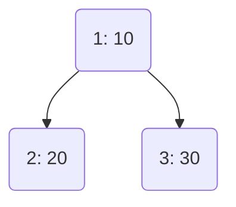

---

### Пример 2

```txt
4
5 10 15 20
1 2 2
```

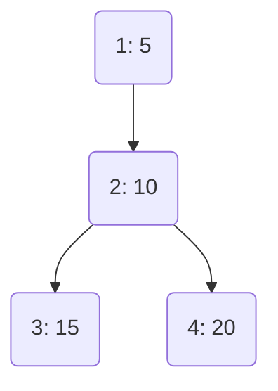

---

### Пример 3

```txt
4
1 2 3 4
1 1 3
```

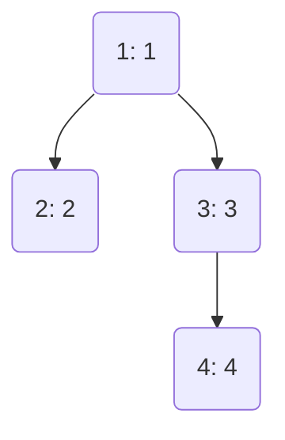

---

### Пример 4

```txt
5
1 2 3 4 5
1 2 3 4
```

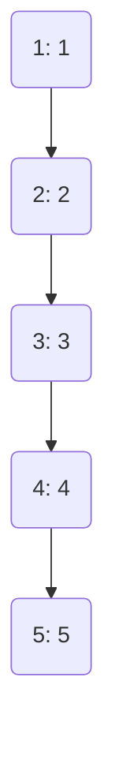

---

### Пример 5

```txt
9
1 100 1 90 80 1 2 3 4
1 1 2 4 3 3 3 3
```

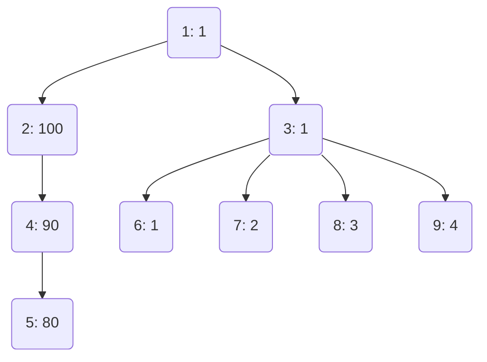

---

### Пример 6

```txt
6
5 4 10 3 9 1
1 2 1 4 1
```

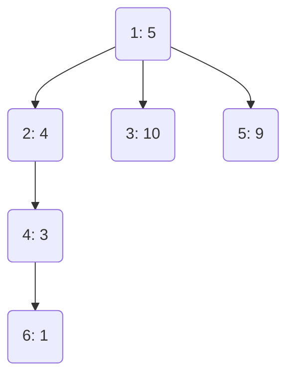

---

### Пример 7

```txt
4
10 10 20 1
1 2 1
```

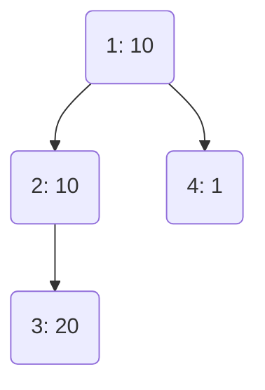

---

## Рассуждения

Возьму пример 5 как самый большой и общий.

Входные данные:

```txt
9
1 100 1 90 80 1 2 3 4
1 1 2 4 3 3 3 3
```

Результат:

```txt
-1 -1 -1 -1 110 200 280 281 282
```

Предельные случаи:
1. это когда все вершины поодиночке (все множества по одной вершине, получается n множеств).
2. это когда все вершины в одном множестве (это будет всё дерево).

Первый случай не имеет ограничений и может быть реализован всегда.

Второй случай ограничен условием - всё что две вершины и более - это путь от листа к корню дерева.
Получается, что минимально возможное количество множеств ограничено количеством листьев - всё что меньше - выдать "-1".

Всё остальное - промежуточные варианты.

Для каждого числа n (число групп или путей, на которое разбиваем дерево) нужно вывести оценку - одно число.
Это число - сумма максимально возможной подборки значений среди вершин группы.

На каждом цикле нам дано число - на какое количество групп нужно разбить дерево.
Группы надо подобрать так, чтобы оценка разбиения с указанным числом групп получилась максимальной.
Как этого достичь?

Каждая вершина - имеет свою ценность (для примера `5` это `1 100 1 90 80 1 2 3 4`).

Для каждой группы мы производим оценку, она заключается в поиске вершины в группе с максимальной ценностью.

После этого мы складываем оценки всех групп и так получаем оценку всего разбиения.

Чтобы получить максимальную оценку разбиения имеет смысл отсортировать вершины по их ценности.

Чтобы оценить минимальное число групп, на которое можно разбить дерево - нужно найти число его листьев.

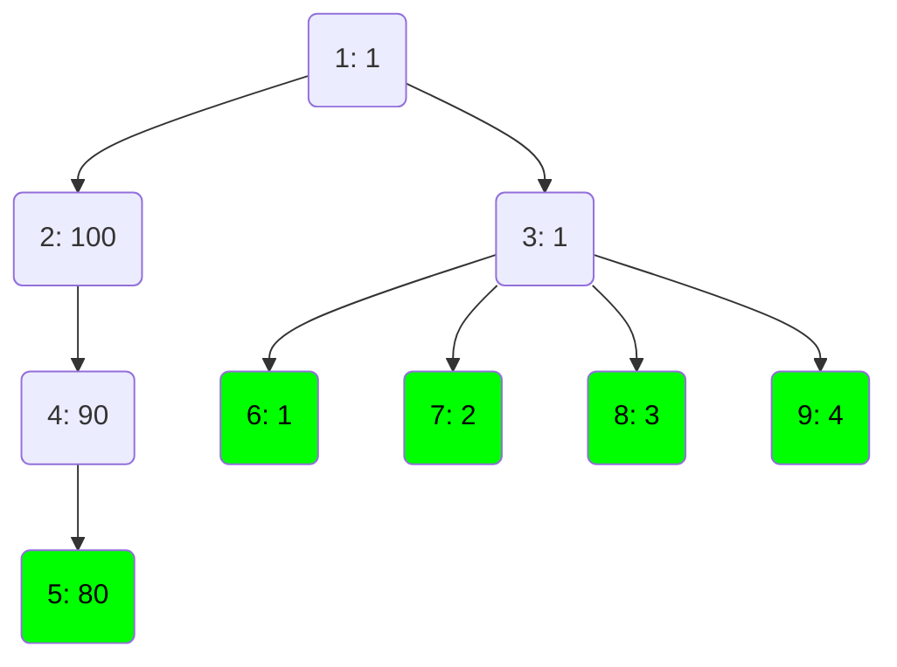

У данного графа их 5, значит всё, что меньше 5 групп надо выдать -1.

---

Первый вариант, который можем получить - это 5 групп.

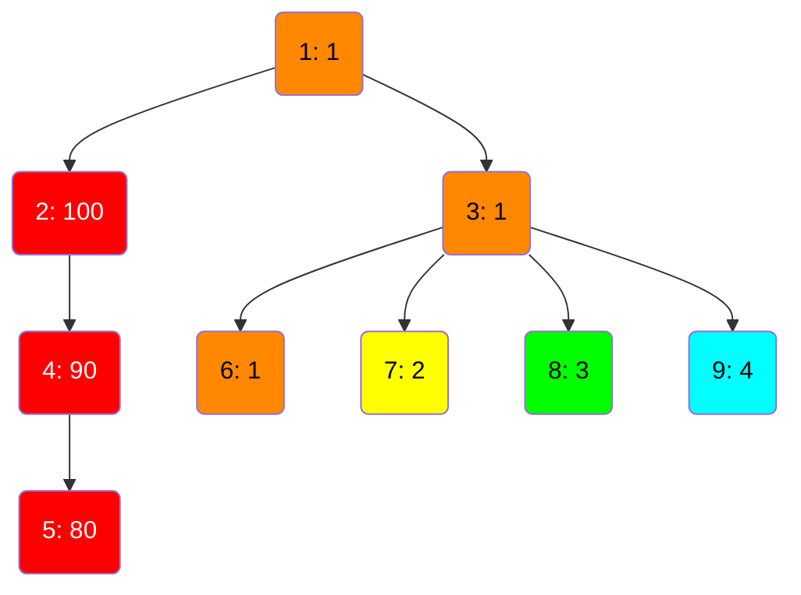

Оценка групп:
- К:    100
- О:    1
- Ж:    2
- З:    3
- Г:    4

Суммарно    `110`

Наблюдение: в данном случае - неважно куда попадёт корень, так как его значение минимальное.

---

Далее - 6 групп.

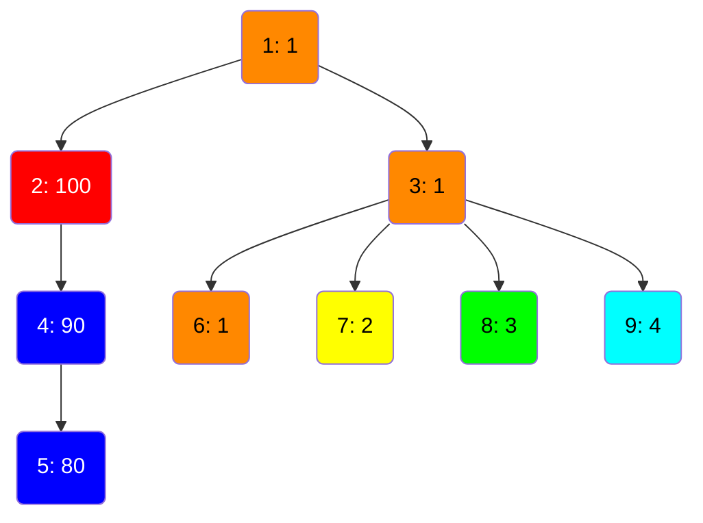

Оценка групп:
- К:    100
- О:    1
- Ж:    2
- З:    3
- Г:    4
- C:    90

Суммарно:   `200`

Наблюдение: в данном случае мы взяли предыдущее разбиение, нашли вершину с самой большой ценностью после 100 - это 90 и сделали из красной группы 2 шт. - красную и синюю. Благодаря новой группе можно к предыдущему результату добавить ещё 90, получится 110 + 90 = 200.

Наблюдение 2: во всех тестовых примерах оценка разбиения всегда возрастает.

---

Далее - 7 групп.

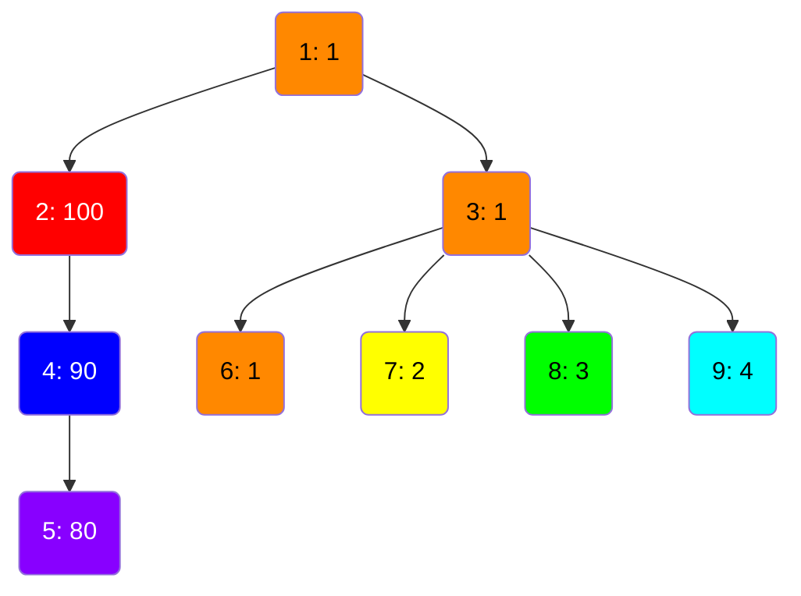

Оценка групп:
- К:    100
- О:    1
- Ж:    2
- З:    3
- Г:    4
- C:    90
- Ф:    80

Суммарно:   `280`

---

Далее - 8, 9

Дальше берём оранжевую группу и разбиваем подграф на 8 и 9 групп, получаю сумму 281 и 282.

Тут всё очевидно.

---

Нужно сделать пример, который бы охватывал следующие моменты:
1. Ценность узлов должна или расти или убывать от корня к листу (чтобы в примере были оба варианта).
2. Ценность корня дерева не должна быть максимальной или минимальной.

Сделаю пример с тремя путями от самого корня.

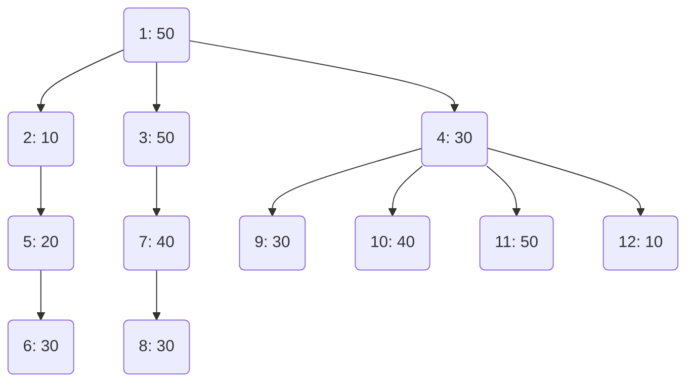

6 листьев - значит минимум 6 групп мы можем получить на первом шаге.

Можно выделить первый шаг решения:
Обход дерева в грубину для подсчёта числа листьев и распределения узлов по группам для самого первого варианта.

Почему лучше НЕ начинать с варианта - когда все узлы отдельно (когда размер группы - 1 узел, а число групп равно числу узлов)?

Лучше начну с минимального числа групп.

При минимальном k каждая цепь обязана заканчиваться в листе. Это означает:
- Каждый лист принадлежит ровно одной цепи.
- Каждая цепь содержит ровно один лист.
- Все вершины дерева распределены по цепям так, что каждая цепь — это путь от некоторой вершины до листа.

Попробую обход дерева в грубину (DFS) и так буду считать число листьев и строить первоначальный расклад по группам.

